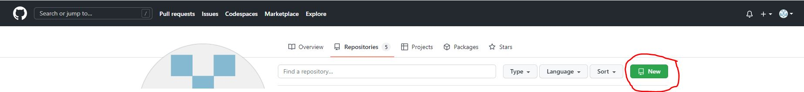

#Начало работы
1. Для начала работы необходимо скачать и устоновить программу git и VS Studio
2. Создать папку на рабочим столе отокрыть её в VS Studio и открыть терминал
3. Для начала работы необходимо проверить правильно ли установлен git, командой (git --
version)
#Коммиты
1. Для начала необходимо создать файл, назвать его
2. Записать в него информацию
3. сохранить Файл "ctrl + S"
4. Веести команду git add название файла, или для простаты команду git .
5. Создать коммит командой git commit -m "название коммита"
#Список коммитов
1. для того чтобы вывести спиок коммитов нужно написать команду git log
2. для упрощенного просмотра git log --oneline 
#Ветки
1. когда вводиться команда git init автоматически создаеться ветка Master
2. для создания новой ветки используеться команда git branch название ветки
3. для перехода на новую ветку git checkout название ветки
4. для выведение списка git branch
5. для вливание в текущую ветку git merge название ветки
6. для удаление слитой ветки git branch -d название ветки
#Переход
1. Что бы перейти от одного коммита к другому нужно ввести команду git checkout уникальный номер коммита который указан в спимке коммитов
#Работа с удаленным репозиторием
1. Что бы скоприровать на локальный диск внешний репозитрий команда git clone адрес ссылки
2.что бы загрузить с локального на удаленный команда git push
3. Чтобы принять на локальном изменения с удаленого git pul

## Работа с удаленным репозиторием

1. Для начала нужно создать учетную запись на сайте github.com
2. Копирование внешнего репозитория на на свой ПК:
* создаете на сайте GitHub репозиторий с помощью кнопки New во вкладке Repositories

* устанавливаете его параметры: название, будет ли он открытым или закрытым и т.д. и нажимаете на кнопку Create repository;
* копируете ссылку на него

* в программе Visual Studio Code вводите команду git clone и после пробела вставляете ссылку на репозиторий, нажимаете Enter

Переходите в скопированную вами папку с помощью команды **cd имя папки**. С помощью команды **git status** убеждаетесь, что все корректно сделано.
3. Если вы произвели какие-то изменения в репозитории на своем компьютере (т.е. внесли изменения в ЛОКАЛЬНЫЙ репозиторий), и вам необходимо обновить его содержимое на сайте GitHub (т.е. продублировать изменения в удаленном репозитории):
* сохраняете все сделанные изменения с помощью поочередного выполнения команд **Ctrl+S** с клавиатуры, затем **git add .**, затем **git commit -m "Текст коммита"**;
* вводите команду **git push** в терминале;
* обновляете на сайте GitHub страницу с репозиторием, проверяете, что все сделано корректно, и изменения появились.
4. Если вам нужно продублировать изменения с удаленного репозитория в локальном, в терминале вводите команду **git pull**. По этой команде произойдет скачивание всего материала из текущего удаленного репозитория и автоматический merge с локальной версией.
5. Если вы хотите поучаствовать в каком-либо "open sourse проекте":
* создаете ответвление интересующего вас репозитория с помощью кнопки Fork

С помощью этой команды вы как бы создаете копию этого удаленного репозитория в своей учетной записи.
* создаете локальную копию скопированного вами удаленного репозитория с помощью команды **git clone** так, как это описано выше;
* создаете новую ветку в клонированном локальном репозитории так, как это было описано ранее;
* переходите в новую созданную ветку;
* вносите в файлы изменения и сохраняете их в этой новой ветке;
* с помощью команды **git push --set-upstream origin имя своей ветки** сохраняете сделанные вами в локальном репозитории изменения в свою копию удаленного репозитория;
* с помощью кнопки **pull request** предлагаете хозяину репозитория принять внесенные вами изменения.