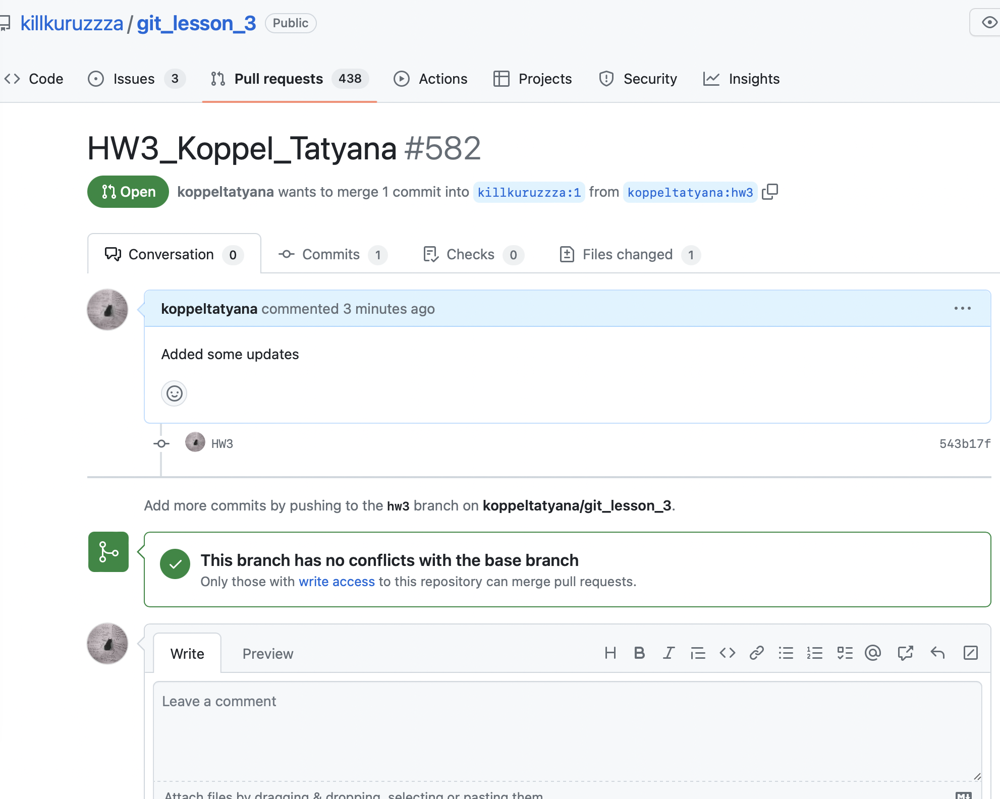

# Работа с GIT и файлами формата .md

### Работа с GIT
#### Преднастройка GIT

* git *config* --global user.name **"your_name"** - первоначальная аутентификация (имя)
* git *config* --global user.email **"your_email"** - первоначальная аутентификация (эл. почта)

#### Основные команды GIT
* git *init* - инициализация локального репозитория
* git *add* **file_name** - добавить файл (файлы) к следующему коммиту
* git *status* - получить информацию от git о его текущем состоянии
* git *commit* -m **"message"** - создание коммита
* git *log* - вывод на экран истории всех коммитов с их хэш-кодами (можно использовать с флагами *--all* / *--oneline* для большего удобства)
* git *checkout* **commit_id** - переход от одного коммита к другому
* git *checkout* **branch_name** - переход на ветку branch_name
* git *chechout* **master** (или *main*) - вернуться к актуальному состоянию и продолжить работу
* git *diff* - показать разницу между текущим файлом и закоммиченным файлом
* git *merge* **branch_name** - влить ветку branch_name в текущую ветку

#### Как разрешать конфликты:
Конфликты при мерже веток - это обычное дело. Редактор предлагает принять вариант вашей ветки, вариант ветки, которую вливаем или все изменения. В данный момент (изображение прикреплено ниже) конфликт был разрешен принятием всех измнений. После чего были в ветке main был создан коммит с измнениями после разрешения конфликта.
_**Как же происходит на практике**_: конечно же никто не коммитит ничего прямо в мастер. Все должны _подливать актуальный мастер себе в ветки_, решать конфликты и вливать свои ветки в мастер уже с разрешенными конфликтами.

 

### Работа с файлами формата .md

#### Выделение текста

* Для выделения текста *курсивом*, нужно указать текст со звездочками (*). Также можно использовать знак _нижнего подчеткивания_ (_).
* Для выделения текста **полужирным**, нужно указать текст в двойных звездочках (**). Также можно использовать двойной знак __нижнего подчеркивания__ (__).
* Для написания ~~зачеркнутого~~ текста, нужно указать текст со знаком тильда (~).

Альтернативные варианты для выделения нужны для того, чтобы можно было использовать их одновременно. Например, 
>_строка курсивом и слово **"полужирный"** будет полужирным_.

#### Работа со списками

Для создания маркированного списка, нужно писать каждый пункт списка со знаком звездочка (*). Например,
* пункт 1
* пункт 2

Для создания нумерованного списка, нужно писать каждый пункт списка с нужной цифрой. Например,
1. Пункт 1
2. Пункт 2

#### Работа с цитатами

Чтобы оформить цитату, нужно поставить знак ">" для цитаты первого уровня, знак ">>" для цитаты второго уровня, т.е. цитата внутри цитаты и т.д. Например, 

> Это пример цитаты,
> в которой перед каждой строкой
> ставится угловая скобка.

Пример цитаты с вложенностью:

> Первый уровень цитирования
>> Второй уровень цитирования
>>> Третий уровень цитирования
>
>Первый уровень цитирования

#### Ссылки

Чтобы оформить ссылку в тексте, нужно в квадратных скобках указать текст ссылки и после чего в круглых скобках указать ссылку. [Посмотреть картинки котиков](https://yandex.ru/images/search?from=tabbar&text=котики)

#### Работа с таблицами

Для оформления таблиц нужно использовать знак модуля как разделитель столбцов, разделение строк происходит автоматически при переводе каретки на след строку.
Пример таблицы. Краткое описание команд GIT'а:

| Название команды git            | Описание команды                                         |          
| ------------------------------- | -------------------------------------------------------  |
| git **init**                    | инициализация локального репозитория                     |
| git **add**                     | добавить файл (файлы) к следующему коммиту               |
| git **commit** -m "message"     | создание коммита                                         |
| git **status**                  | получить информацию от git о его текущем состоянии       |
| git **log**                     | вывод на экран истории всех коммитов с их хэш-кодами (можно использовать с флагами *--all* / *--oneline* для большего удобства)|
| git **diff**                    | показать разницу между текущим файлом и закоммиченным файлом |
| git **checkout** *branch_name*  | git checkout *branch_name*                               |
| git **merge** *branch_name*     | влить ветку *branch_name* в текущую ветку                |

#### Скрин с PR

