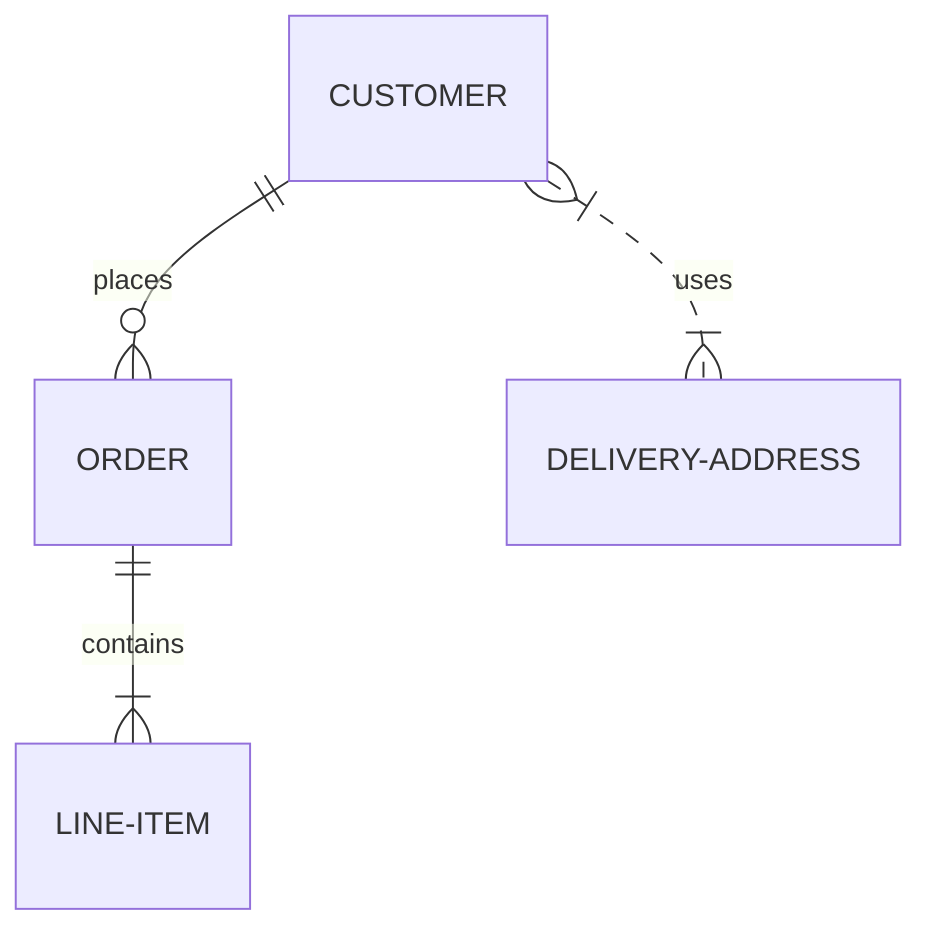

# Инструкция по работе с Markdown

## выделение текста
 Чтоб выделить текст курсивом нужно с двух сторон поставить * *вот так*
 Текст, выделенный полужирным шрифтом с использованием синтаксиса языка Markdown ** текст**
 Текст, выделенный курсивным полужирным шрифтом ***текст***
## Списки 
Гиперссылка, с немедленным указанием адреса (внутритекстовая);
Гиперссылка, подобная сноске.
 Для создания внутритекстовой гиперссылки необходимо использовать круглые скобки сразу после закрывающей квадратной. Внутри них необходимо поместить URL-адрес.
 [пример](http://example.com/ "Необязательная подсказка")
 При создании сносной гиперссылки вместо целевого адреса используется вторая пара квадратных скобок, внутри которых помещается метка, идентификатор ссылки (id).
 [пример][id]:
 Также, можно использовать пробел, чтобы отделять 2 пары квадратных скобок:

[пример] [id]: 
В этом случае возможно определить идентификатор в любом месте документа:

[id]: http://example.com/ "Необязательная подсказка"
Markdown позволяет также использовать неявно выраженный идентификатор (сокращенный). В этом случае метка не приводится, вместо неё текст гиперссылки используется и в качестве её имени, а вторая пара квадратных скобок остаётся пустою. Например, чтобы сделать слово «Example» гиперссылкой, ведущей на сайт http://example.com/, достаточно написать:

[Example][]
и затем определить гиперссылку:

[Example]: http://example.com/
## Работа с изображениями 
В Markdown существует 2 способа вставки изображений в документ:

a. С помощью непосредственного указания URL-адреса изображения. Синтаксис данной команды выглядит следующим образом:


или


Иными словами, он состоит из следующих элементов:

восклицательный знак;
квадратные скобки, в которых указывается альтернативный изображению текст (он станет содержимым атрибута в элементе img);
круглые скобки, содержащие URL-адрес или относительный путь изображения, а также (необязательно) всплывающую подсказку, заключённуе в двойные или одиночные кавычки.
b. С помощью метки-идентификатора. Синтаксис данной команды записывается следующим образом:

![Альтернативный текст][id]
где «id» — имя определённой метки изображения. Метки изображений определяются при помощи синтаксиса, совершенно идентичного меткам гиперссылок:

[id]: путь/к/изображению "Необязательная подсказка"
Важной особенностью является то, что Markdown не позволяет задать размеры изображения (ширину, высоту).
## Цитаты
Цитаты
Для обозначения цитат в языке Markdown используется знак «больше» («>»). Его можно вставлять как перед каждой строкой цитаты, так и только перед первой строкой параграфа. Также синтаксис Markdown позволяет создавать вложенные цитаты (цитаты внутри цитат). Для их разметки используются дополнительные уровни знаков цитирования («>»). Цитаты в Markdown могут содержать всевозможные элементы разметки. Цитаты в языке Markdown выглядят следующим образом:

>Это пример цитаты,
>в которой перед каждой строкой
>ставится угловая скобка.

>Это пример цитаты,
в которой угловая скобка
ставится только перед началом нового параграфа.
>Второй параграф.
Вложение цитаты в цитату выглядит следующим образом:

> Первый уровень цитирования
>> Второй уровень цитирования
>>> Третий уровень цитирования
>
>Первый уровень цитирования
В результате на экран выводится следующее:

Это пример цитаты, в которой перед каждой строкой ставится угловая скобка.

Это пример цитаты, в которой угловая скобка ставится только перед началом нового параграфа.

Второй параграф.

Вложенная цитата:

Первый уровень цитирования

Второй уровень цитирования

Третий уровень цитирования

Первый уровень цитирования

Уровень цитирования не может превышать 15-й.
## Работа с таблицами 
HTML-таблицы работают только в Markdown и конвертируются только в HTML; решается только проблема богатого форматирования в ячейках.
Генераторы таблиц требуют переключаться из текстового редактора, в них неудобно редактировать собственно содержимое ячеек (пример).
Плагины редакторов (Emacs Org-Mode, плагины VIM) не универсальны и не всегда доступны.

Напротив, с фильтром для итоговых таблиц работает pandoc-crossref и все плюшки Pandoc. Фильтр можно использовать и для генерации стандартных таблиц Markdown, указав соответствующий выходной формат. Из недостатков:


Нельзя объединять ячейки, Pandoc не поддерживает этого (пока).
Для горизонтальных таблиц стилизацию приходится делать средствами выходного формата, например, через CSS.

Описание таблицы включает три части:


Структура таблицы


Упорядоченный список граф (столбцов):


Как минимум, у столбца должен быть заголовок (title).
Чтобы можно было переставлять столбцы, не трогая данные, должен быть указан атрибут записи, отображаемый в столбце (id).
Специальные столбцы не имеют id, а имеют описание, как их заполнять. Для начала нужен порядковый номер (special: number).
Выравнивание столбца (align).

Также таблица может быть вертикальной или горизонтальной (orientation). В последнем случае графы будут строками.


Свойства таблицы: ID для ссылок (id) и подпись (caption). Pandoc позволяет делать подписи к таблицам, но не к блокам кода.


Данные в виде массива словарей YAML.
## Сылки
Markdown поддерживает упорядоченные (нумерованные) и неупорядоченные (ненумерованные) списки. Для формирования неупорядоченный списков используются такие маркеры, как звездочки, плюсы и дефисы. Все перечисленные маркеры могут использоваться взаимозаменяемо. Для формирования упорядоченных списков в качестве маркеров используются числа с точкой. Важной особенностью в данном случае является то, что сами номера, с помощью которых формируется список, не важны, так как они не оказывают влияния на выходной HTML код. Как бы ни нумеровал пользователь список, на выходе он в любом случае будет иметь упорядоченный список, начинающийся с единицы (1, 2, 3…). Эту особенность стоит учитывать в том случае, когда необходимо использовать порядковые номера элементов в списке, чтобы они соответствовали номерам, получающимся в HTML. Упорядоченные списки всегда следует начинать с единицы. Маркеры списков обычно начинаются с начала строки, однако они могут быть сдвинуты, но не более чем на 3 пробела. За маркером должен следовать пробел, либо символ табуляции. При необходимости в список можно вставить цитату. В этом случае обозначения цитирования ( «>» ) нужно писать с отступом. Упорядоченные списки выглядят следующим образом:

1.	Проводник
2.	Полупроводник
3.	Диэлектрик
Неупорядоченные списки выглядят следующим образом:

* Проводник
* Полупроводник
* Диэлектрик
Или

- Проводник
- Полупроводник
- Диэлектрик
Или

+ Проводник
+ Полупроводник
+ Диэлектрик
На выходе всех трех перечисленных вариантов имеется один и тот же результат. В результате на экран выводится следующее:

Проводник
Полупроводник
Диэлектрик
и

Проводник
Полупроводник
Диэлектрик
Цитата, вставленная в список, выглядит следующим образом:

1. Элемент списка с цитатой:

    > Это цитата
    > внутри элемента списка.

 2. Второй элемент списка
В результате на экран выводится следующее:

Элемент списка с цитатой:

Это цитата внутри элемента списка.

Второй элемент списка

При вставке цитат в элементы списка важно учитывать, что элементы списка должны находиться на одном уровне, а цитаты должны указываться с отступом. В случае, если правило с единым уровнем списка не соблюдается, следующий после цитаты элемент списка будет автоматически нумероваться цифрой «1.». Кроме того, при необходимости в список можно вставить исходный код. В этом случае его нужно писать с двойным отступом – 8 пробелов или 2 символа табуляции.

Элемент списка, содержащий исходный код

 <исходный код >  
Блоки кода
Отформатированные блоки кода используются в случае необходимости процитировать исходный код программ или разметки. Для создания блока кода в языке Markdown необходимо каждую строку параграфа начинать с отступа, состоящего из четырех пробелов или одного символа табуляции. Блок кода продолжается до тех пор, пока не встретится строка без отступа (или конец текста). Внутри блока кода амперсанды («&») и угловые скобки («<» и «>») автоматически преобразуются в элементы HTML разметки. Кроме того, следует отметить, что внутри блоков кода обычный синтаксис Markdown не обрабатывается. Блок кода в Markdown выглядит следующим образом:

Это обычный параграф:

Это блок кода
Горизонтальные линии (разделители)
Для того чтобы создать горизонтальную линию с использованием синтаксиса языка Markdown, необходимо поместить три (или более)дефиса или звездочки на отдельной строке текста. Между ними возможно располагать пробелы. Горизонтальные линии в Markdown выглядят следующим образом:

Первая часть текста, который необходимо разделить
***
Вторая часть текста, который необходимо разделить
Или

Первая часть текста, который необходимо разделить

---

Вторая часть текста, который необходимо разделить
В результате на экран выводится следующее:

Первая часть текста, который необходимо разделить

Вторая часть текста, который необходимо разделить

При использовании данного инструмента важно помнить, что после первой части текста и перед второй необходимо оставлять пустую строку. Данное правило необходимо соблюдать только при использовании дефисов. Если его не соблюдать, на экран будет выведен заголовок второго уровня и строка обычного текста. При использовании символа звездочки данным правилом можно пренебречь.
#### Список задач
(Task List)
Можно создавать "Списки задач" для этого необходимо использовать `- [ ]` для поставленной задачи и `- [X]` для выполненной задачи.
```
- [X] Придумать внешний вид резюме
- [ ] Написать основные категории
- [X] Опубликовать

```
- [X] Придумать внешний вид резюме
- [ ] Написать основные категории
- [X] Опубликовать

Также можно создавать многоуровневые списки задач. Каждый уровень отделяется **четырьмя** (4) пробелами:
```
- [X] Задача 1
    - [X] Подзадача 1 для Задачи 1
    - [X] Подзадача 2 для Задачи 1
- [ ] Задача 2
    - [X] Подзадача 1 для Задачи 2
    - [ ] Подзадача 2 для Задачи 2
- [ ] Задача 3
    - [ ] Подзадача 1 для Задачи 3
        - [ ] Подзадача 1 для Подзадача 1 для Задачи 3
```
- [X] Задача 1
    - [X] Подзадача 1 для Задачи 1
    - [X] Подзадача 2 для Задачи 1
- [ ] Задача 2
    - [X] Подзадача 1 для Задачи 2
    - [ ] Подзадача 2 для Задачи 2
- [ ] Задача 3
    - [ ] Подзадача 1 для Задачи 3
        - [ ] Подзадача 1 для Подзадача 1 для Задачи 3
    
[:arrow_up:Оглавление](#Оглавление) 
___
## Ссылки
Либо просто вставить ссылку, либо дополнительно задать текст ссылки (пробела между скобками быть не должно):
```
Первый вариант вставки ссылок - это просто написать адрес сайта http://sabaka.net
```
Первый вариант вставки ссылок - это просто написать адрес сайта http://sabaka.net

Второй вариант записывается так: `[текст ссылки](адрес ссылки)`
```
[sabaka.net](http://sabaka.net)
```
[sabaka.net](http://sabaka.net)
    
[Sabaka(DOT)Net]:http://sabaka.net    
    
[:arrow_up:Оглавление](#Оглавление)
____
## Вставка изображения
```

```


### Дополнительно:
#### Вставка ссылки с картинкой на ролик с YouTube
Описание комбинации `[](ссылка на страничку YouTube)`        
Пример:        
```[](https://youtu.be/RHPYGwVQB2o)```        
Что мы увидим:        
[](https://youtu.be/RHPYGwVQB2o)        
        
[:arrow_up:Оглавление](#Оглавление) 
____
## Вставка таблиц
```
| LEFT | CENTER | RIGHT |
|----------------|:---------:|----------------:|
| По левому краю | По центру | По правому краю |
| текст | текст | текст |
```
| LEFT | CENTER | RIGHT |
|----------------|:---------:|----------------:|
| По левому краю | По центру | По правому краю |
| текст | текст | текст |

**Внимание:** Если в тексте таблицы нужно использовать символ "вертикальная черта - `|`", то в место него необходимо написать замену на комбинацию HTML-кода* `&#124;`, это нужно для того, что бы таблица не потеряла ориентации.    
*) - Можно использовать ASCII и/или UTF коды.

**Пример:**
```
| Обозначение | Описание | Пример регулярного выражения|
|----:|:----:|:----------|
| literal | Строка содержит символьный литерал literal | foo |
| re1&#124;re2 | Строка содержит регулярные выражения `rel` или `re2` | foo&#124;bar |
```
**Результат:**

| Обозначение | Описание | Пример регулярного выражения|
|----:|:----:|:----------|
| literal | Строка содержит символьный литерал literal | foo |
| re1&#124;re2 | Строка содержит регулярные выражения `rel` или `re2` | foo&#124;bar |

[:arrow_up:Оглавление](#Оглавление) 
____
## Диаграмм Mermaid.js
Появилась возможность вставлять диаграммы [Mermaid.js](https://mermaid-js.github.io/mermaid/#/)

<pre>
```mermaid
... код диаграммы ...
```
</pre>
Пример:
<pre>

</pre>

Очень подробно на русском языке о диаграммах Mermaid.js: https://habr.com/ru/post/652867/ 

[:arrow_up:Оглавление](#Оглавление) 
____
все готово 
я закончил 
# команды гидхаба
Основные команды
Всего несколько команд нужно для базового варианта использования Git для ведения истории изменений.

git add
Команда git add добавляет содержимое рабочего каталога в индекс (staging area) для последующего коммита. По умолчанию git commit использует лишь этот индекс, так что вы можете использовать git add для сборки слепка вашего следующего коммита.

Это одна из ключевых команд Git, мы упоминали о ней десятки раз на страницах книги. Ниже перечислены наиболее интересные варианты использования этой команды.

Знакомство с этой командой происходит в разделе Отслеживание новых файлов главы 2.

О том как использовать git add для разрешения конфликтов слияния написано в разделе Основные конфликты слияния главы 3.

В разделе Интерактивное индексирование главы 7 показано как использовать git add для добавления в индекс лишь отдельных частей изменённого файла.

В разделе Деревья показано как эта команда работает на низком уровне, чтобы вы понимали, что происходит за кулисами.

git status
Команда git status показывает состояния файлов в рабочем каталоге и индексе: какие файлы изменены, но не добавлены в индекс; какие ожидают коммита в индексе. Вдобавок к этому выводятся подсказки о том, как изменить состояние файлов.

Мы познакомили вас с этой командой в разделе Определение состояния файлов главы 2, разобрали стандартный и упрощённый формат вывода. И хотя мы использовали git status повсеместно в этой книге, практически все варианты использования покрыты в указанной главе.

git diff
Команда git diff используется для вычисления разницы между любыми двумя Git деревьями. Это может быть разница между вашей рабочей копией и индексом (собственно git diff), разница между индексом и последним коммитом (git diff --staged), или между любыми двумя коммитами (git diff master branchB).

Мы познакомили вас с основами этой команды в разделе Просмотр индексированных и неиндексированных изменений главы 2, где показали как посмотреть какие изменения уже добавлены в индекс, а какие — ещё нет.

О том как использовать эту команду для проверки на проблемы с пробелами с помощью аргумента --check можно почитать в разделе Правила создания коммитов главы 5.

Мы показали вам как эффективно сравнивать ветки используя синтаксис git diff A…​B в разделе Определение применяемых изменений главы 5.

В разделе Продвинутое слияние главы 7 показано использование опции -w для скрытия различий в пробельных символах, а также рассказано как сравнивать конфликтующие изменения с опциями --theirs, --ours и --base.

Использование этой команды с опцией --submodule для сравнения изменений в подмодулях показано в разделе Начало работы с подмодулями главы 7.

git difftool
Команда git difftool просто запускает внешнюю утилиту сравнения для показа различий в двух деревьях, на случай если вы хотите использовать что-либо отличное от встроенного просмотрщика git diff.

Мы лишь вкратце упомянули о ней в разделе Просмотр индексированных и неиндексированных изменений главы 2.

git commit
Команда git commit берёт все данные, добавленные в индекс с помощью git add, и сохраняет их слепок во внутренней базе данных, а затем сдвигает указатель текущей ветки на этот слепок.

Вы познакомились с основами модели коммитов в разделе Коммит изменений главы 2. Там же мы продемонстрировали использование опций -a для добавления всех изменений в индекс без использования git add, что может быть удобным в повседневном использовании, и -m для передачи сообщения коммита без запуска полноценного редактора.

В разделе Операции отмены главы 2 мы рассказали об опции --amend, используемой для изменения последнего совершённого коммита.

В разделе О ветвлении в двух словах главы 3 мы более подробно познакомились с тем, что делает команда git commit и почему она делает это именно так.

Мы показали вам как подписывать ваши коммиты, используя опцию -S в разделе Подпись коммитов главы 7.

И наконец мы заглянули внутрь команды git commit в разделе Объекты коммитов главы 10 и узнали что она делает за кулисами.

git reset
Команда git reset, как можно догадаться из названия, используется в основном для отмены изменений. Она изменяет указатель HEAD и, опционально, состояние индекса. Также эта команда может изменить файлы в рабочем каталоге при использовании параметра --hard, что может привести к потере наработок при неправильном использовании, так что убедитесь в серьёзности своих намерений прежде чем использовать его.

Мы рассказали об основах использования git reset в разделе Отмена индексации файла главы 2, где эта команда использовалась для удаления файла из индекса, добавленного туда с помощью git add.

В разделе Раскрытие тайн reset, полностью посвящённой этой команде, мы разобрались в деталях её использования.

Мы использовали git reset --hard чтобы отменить слияние в разделе Прерывание слияния главы 7, там же было продемонстрировано использование команды git merge --abort для этих целей, которая работает как обёртка над git reset.

git rm
Команда git rm используется в Git для удаления файлов из индекса и рабочей копии. Она похожа на git add с тем лишь исключением, что она удаляет, а не добавляет файлы для следующего коммита.

Мы немного разобрались с этой командой в разделе Удаление файлов главы 2, показали как удалять файлы из рабочего каталога и индекса и только из индекса, используя флаг --cached.

Ещё один вариант использования git rm приведён в разделе Удаление объектов главы 10, где мы вкратце объяснили как использовать опцию --ignore-unmatch при выполнении git filter-branch, которая подавляет ошибки удаления несуществующих файлов. Это может быть полезно для автоматически выполняемых скриптов.

git mv
Команда git mv — это всего лишь удобный способ переместить файл, а затем выполнить git add для нового файла и git rm для старого.

Мы лишь вкратце упомянули эту команду в разделе Перемещение файлов главы 2.

git clean
Команда git clean используется для удаления мусора из рабочего каталога. Это могут быть результаты сборки проекта или файлы конфликтов слияний.