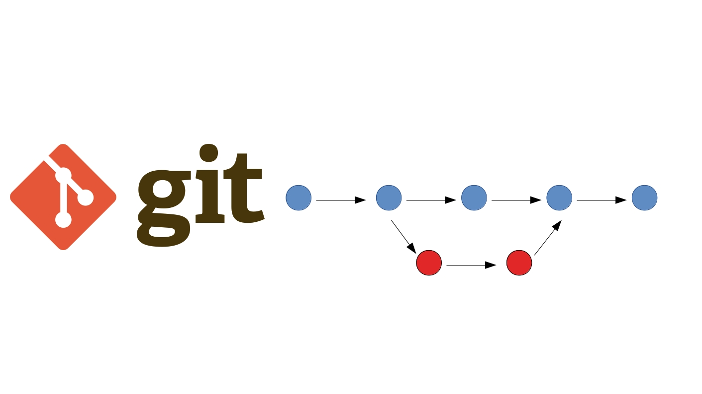

**Инструкция по работе с Git**

*Git - программа для контроля версий*

1. **Начало работы и основные команды в Git.**

После установки git необходимо для идентификации пользователя и фиксиции  создаваемых коммитов указать имя пользователя и адрес электронной почты. Например:

git config --global user.name "Veronika"

git config --global user.email fenek1901@gmail.com

**Команды git:**

- **git init** - инициализация репозитория в существующей папке. В результате в существующей папке появляется еще одна папка с именем .git и всеми нужными  файлами репозитория.

- **git add** - добавляет файлы для отслеживания. Необходимо полсле команды добавить имя файла. Например: *git add __mahual.md__*. 

- **git commit** - выполнит фиксацию изменений.  Например: *git commit -m "Initial commit"*. Флаг *-m* - позволяет добавить сообщение, чтобы понимать, какие изменения были зафиксированы. Параметр *-a* - автоматически индексирует все отслеживаемые файлы перед их фиксацией, позволяя обойтись без команды git add.

- **git clone** -получение копии существующего репозитория.

- **git status** - определяет текущее состояние файлов.

- **git diff** - показывает чем отличается текущий файл от предыдущего (добавленные и удаленные строки и пр.) 

- **git rm** -удаляет указанный файл из рабочей папки, благодаря чему он исчезает из списка неотслеживаемых.

- **git log** - выводит журнал всех изменений. По умолчанию выводится в обратном
хронологическом порядке список сохраненных в репозиторий версий. У данной команды существует множество параметров.

Полезные параметры команды git log:

-**p** — Показывает разницу, внесенную каждым коммитом. А дополнительный параметр -2 ограничивает выводимый результат последними двумя записями: *git log -p -2*

-**stat** — Показывает статистику измененных файлов для каждого коммита.

-**graph** — Отображает ASCII граф с ветвлениями и историей слияний.

- **git show** -  можно просмотреть полный список изменений, внесённых конкретным коммитом, указав идентификатор или хеш коммита.

- **git checkout** – переход от одного коммита к другому. (Или с ветки на ветку)

-  **git checkout master** – позволяет вернуться к актуальному состоянию и продолжить работу.

- **git branch** - выводит список веток на экран. Символ (*) перед веткой master указывает, что именно в этой ветке вы сейчас находитесь. Команда git branch (далее название ветки)- создает новую ветку. Например: *git branch __new_instructions__*. Удалить ненужную ветку можно командой *git branch -d*.

- **git merge** - слияние веток. Достаточно перейти в ветку, с которой будет осуществляться слияние, и воспользоваться командой git merge. В прооцессе слияния могут происходить конфликты. Система приостанавливает процесс до момента разрешения конфликта. Посмотреть, какие файлы
не прошли слияние после возникновения конфликта, позволяет команда git status. Далее возможно открывать файлы вручную и разрешать конфликты. 
Просмотреть историю коммитов в виде графика для текущей ветки можно с помощью параметра log и флагов --graph --oneline --decorate.

- **git revert** - откатить проект до заданного коммита можно с помощью параметра revert и идентификатора коммита.

- **git reset** - откатывает проект к более раннему состоянию, удаляя все последующие коммиты.

2. **Полезные ссылки:**

- Руководство по оформлению Markdown файлов: [Здесь](https://gist.github.com/Jekins/2bf2d0638163f1294637)

- Справочник по Markdown от Microsoft: [Здесь](https://docs.microsoft.com/ru-ru/contribute/markdown-reference)

- 30 основных команд (Хабр), которые сделают из вас мастера Git: [Здесь](https://habr.com/ru/company/ruvds/blog/599929/?ysclid=l8737b3pbk655593671)

**Работа с удаленными репозиториями.**

- __*Основные команды для работы с удаленными репозиториями:*__

1. Для управления подключением удаленных репозиториев в Git предусмотрена целая группа команд – **git remote.** 

*git remote add* <название удаленного репозитория> <ссылка на удаленный репозиторий> - Подключает удаленный репозиторий к вашему под переданным именем.

*git remote remove* <название удаленного репозитория> - Отключает переданный удаленный репозиторий от вашего.

*git remote rename* <старое имя удаленного репозитория> <новое имя удаленного репозитория> - Меняет имя переданного удаленного репозитория.

*git remote show* [имя удаленного репозитория] - Выводит список всех подключенных удаленных репозиториев. Если передано имя репозитория, то выводит информацию об этом репозитории.

2. **git clone** <ссылка на удаленный репозиторий> - Клонирует переданный репозиторий на ваш компьютер.

Ссылку на удаленный репозиторий можно получить нажав на зеленую кнопку Code на главной странице репозитория на GitHub.

3. **git fetch** [ключи] [имя удаленного репозитория] - Получает изменения из переданного удаленного репозитория. Если не было передано ни одного удаленного репозитория, ни ключа --all, команда пытается получить изменения из репозитория с именем origin.

4. **git pull** [ключи] [имя удаленного репозитория] - Получает изменения из переданного удаленного репозитория и обновляет рабочую копию в соответствии с удаленным репозиторием. По умолчанию слияние удаленной ветки с локальной происходит именно в fast-forward режиме, так что включать его специально не требуется.

5. **git push** [ключи] [имя удаленного репозитория] [имя ветки] - Загружает изменения в удаленный репозиторий. Если слияние изменений в удаленном репозитории нельзя сделать в режиме fast-forward, и при этом не был передан ключ force, выполнение закончится с ошибкой.

- __*Создание репозитория на GitHub*__

Чтобы создать свой репозиторий, нужно нажать на зеленую кнопку New.

Откроется страница создания репозитория. 

*Поля для заполнения:*

Repository name – имя репозитория. Нужно придумать имя, которое будет отображаться на странице репозитория. 

Description – описание. Его заполнять необязательно. Но дбыло проще понять, что в нем содержится, можно  заполнить графу описания.

Затем можно выбрать, будет ли репозиторий открытым, то есть доступным абсолютно всем пользователям GitHub, или закрытым, то есть доступным только вам и людям, которым вы предоставите доступ.

Последние три поля предлагают нам добавить, соответственно, README-файл, .gitignore файл и выбрать лицензию для нашего проекта.

- **Создание форка репозитория на GitHub. Пулл-реквесты.**

Форк (от англ. fork – вилка) – точная копия репозитория, но в вашем аккаунте. Форки нужны, чтобы вносить свои изменения в проект, к репозиторию которого нет прямого доступа.

Пулл-реквест (от англ. pull-request – запрос pull) – функция GitHub, позволяющая попросить владельца репозитория, от которого мы сделали форк, загрузить наши изменения обратно в свой репозиторий.

 Форки и пулл-реквесты нужны, чтобы любой пользователь мог внести свой вклад в любой открытый проект, репозиторий которого есть на GitHub.

 1. Для начала зайдем на страницу репозитория проекта. Нажимаем на кнопку Fork.

 2. Клонируем репозиторий к себе на компьютер командой git clone. Создадим файл README.md с описанием проекта, чтобы другим пользователям было понятно, в чем отличие этой реализации от остальных.

 3. Сделаем коммит и выполним git push, чтобы загрузить  изменения в удаленный репозиторий.

 4. Теперь GitHub подсказывает нам, что наша ветка опережает ветку исходного репозитория на один коммит и предлагает сделать пулл-реквест.

 5. Нажимаем на кнопку Compare на подсказке GitHub, либо переходим на вкладку Pull Requests и нажимаем New pull request.

 6. Перед нами откроется страница создания пулл-реквеста. Как только мы выбрали ветки и убедились, что не внесли никаких лишних изменений, нажимаем кнопку Create pull request.

 7. Теперь  попадаем на страницу описания наших изменений. Здесь необходимо описать, что за изменения были внесены и почему они были необходимы. Затем можно нажимать кнопку Create pull request.

 Полезная ссылка: [ТУТ](https://smartiqa.ru/courses/git/lesson-6)