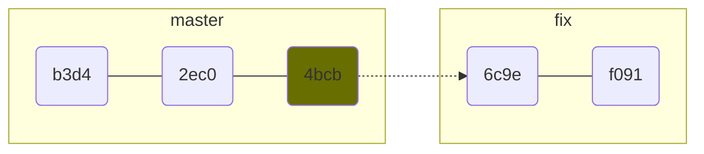
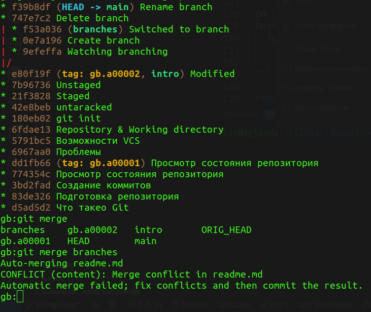

# Интструкция для работы с Git и удаленным репозиторием

## Что такео Git?

Git - это одна из реализаций распределенных систем контроля версий, имеющая как локальниые, так и удлаенные репозитории.
Является самой популярной реализацией систем контроля версий в мире.

## Подготовка репозитория 

Для создания репозитория необходимо выполнить команду 'git init' в папке с репозиторием:

```
git init
```

После чего у вас создастся репозиторий (появится скртая папка `.git`):

```
git/
├── branches
├── config
├── description
├── HEAD
├── hooks
│   ├── applypatch-msg.sample
│   ├── commit-msg.sample
│   ├── fsmonitor-watchman.sample
│   ├── post-update.sample
│   ├── pre-applypatch.sample
│   ├── pre-commit.sample
│   ├── pre-merge-commit.sample
│   ├── prepare-commit-msg.sample
│   ├── pre-push.sample
│   ├── pre-rebase.sample
│   ├── pre-receive.sample
│   ├── push-to-checkout.sample
│   └── update.sample
├── info
│   └── exclude
├── objects
│   ├── info
│   └── pack
└── refs
    ├── heads
    └── tags
```

## Создание коммитов

### Git add

Для добавления изменнений  в коммит используется команда `git add`.

Для того что бы использовать команду `git add` напишите:

```
git add <имя файла>
```

### Просмотр состояния репозитория

Для того что бы проверить стсояние репозитория используется команда `git status`.
Для этого необходимо в папке с репозиторием  написать:

```
git status
```

и вы увидите былили изменения в файлах или их не было.

### Создание коммитов

Для того что бы создать коммит (сохранение) необходимо выполнить команду `git commit`.

Выполняется она так:

```
git commit -am"Создание коммитов"

[main 774354c] Просмотр состояния репозитория
 1 file changed, 10 insertions(+), 2 deletions(-)
```

## Состояния файлов

**Untracked** - файл не под версионным контролем

```bash
touch file
```

```bash
git status

On branch master
No commits yet
Untracked files:
  (use "git add <file>..." to include in what will be committed)

    file
```

**Staged** - отслеживаемый файл 

```bash
git add file
```

```bash
git status
On branch master
Changes to be committed:
  (use "git reset HEAD <file>..." to unstage)

    new file:   file
```

**Unstage** - файл удален из трекинга

```bash
git reset HEAD file        # или выташить из репозитория в index конкретный файл
```

```bash
git status 

On branch master
Untracked files:
  (use "git add <file>..." to include in what will be committed)

    file
```

**Modified** - внесенные изменения в working directory

>  Внесём изменения в файл

```bash
git status

On branch master
Changes not staged for commit:
  (use "git add <file>..." to update what will be committed)
  (use "git checkout -- <file>..." to discard changes in working directory)

    modified:   file
```

## Ветвление

### Просмотр веток

```bash
git branch      # Просмотр всех существующих веток.
* master
```

```bash
git branch -a		# all все скрытые ветки тоже
* master
```

```bash
git branch -v		# Подробно с hash-code и коментариями.
* master 795dda0 initialization commit
```

### Новая ветка

```bash
git branch fork_first           # Create branch
git branch -v
 feature 795dda0 commit A       # новая ветка будет указывать на тот же коммит что и мастер
* master 795dda0 commit A       # *сейчас мы в мастере
```

### Переключение весток

Коммиты - не принадлежат веткам. Структура коммитов существует сама по себе безотносительно них. Ветки накладываются поверх коммитов как указатели. Это, например, означает, что изменение коммита общего для нескольких веток отражается на всех ветках, в которые попал этот коммит.

### `checkout`

`git checkout <branch>`    -     переключаться между **branch** (ветками)

```bash
git checkout feature
git branch -v
* feature 795dda0 commit A          # *теперь мы в feature
  master  795dda0 commit A
```

`-b` - создать ветку и сразу перейти в нее

```bash
git checkout -b fix                # Create and Switched to a new branch 'fix'
git branch -v
  feature 795dda0 commit A
* fix     795dda0 commit A         # *Ветка создана и мы сразу в нее перешли.
  master  795dda0 commit A
```

На этой стадии  если в index'е есть каикето неакомиченные изменения то они все попадут в нову ветку. Чтобы эти изменения стали раздельными нужно сделать хотя бы 1 коммит в новой веткке.

`-f` `--force` - принудительно переключиться а другую ветку.

Если при переключении веток есть какието <u>не проиндексированные изменения в working directory</u>, то git выдаст ошибку.

```bash
error: Your local changes to the following files would be overwritten by checkout:
    file
Please commit your changes or stash them before you switch branches.
Aborting
```

т.к. при переключении веток, git из индекса <u>**перезаписывает файлы** в **working directory**</u> (Перезаписывает содержимым на которое указывает HEAD). Так гит предупреждает что бы случайно не затереть не проиндексированные изменения.

Параметр `--force` - позволяет принудительно переключиться на другую ветку, перезаписав working directory.

```bash
git checkout -f master     # все файлы перезапишутся версиями из master
```

```
Если мы находимся в ветке и еще не делали commit и хотим удалить все изменения и вернутся к последнему коммиту:
```

```bash
git checkout -f HEAD    
```

Если файлы еще не готовы для коммита, но нужно переключиться на другую ветку, то текущие изменения можно сохранить в специаотном стеке `git stash`  и позже востановить их.

## Удаление ветки

```bash
git branch -d fork_first  # удалить если ветка смержина
git branch -D fork_two    # принудительно удалить в любом случае   
```

Если коммиты были в ветках то при удаление сами коммиты останутся в проекте. Удаляются только (ссылки)

Поэтому можно отменить удаление создав новую ссылку на ветку

```bash
git branch new_name hash   # hash коммта головы удаленной ветки
```

## Переименование ветки

```bash
git branch -m novoje-imia
```

## Слияние

### Fast-forward

Fast-forward - Происходит тогда когда изменения в новой ветке (созданной от master ветки), не конфликтуют с мастер-веткой (те в мастере не должно быть изменений). Получается что новая ветка, фактически, просто продолжает мастер-ветку. ( т.е. сливаемая ветка прямой потомок)



В этом случае git просто перенесет указатель **(master)** на голову новой ветки и сделает ее частью master.

```mermaid
graph LR;
subgraph HEAD -> master, fix
    init(b3d4)---A(2ec0)---B(4bcb)---D(6c9e)---E(f091):::HEAD
end
classDef HEAD fill:#686E00;
```

**merge**

```bash
git merge feature 
Updating 795443f..725eea8
Fast-forward
 file | 5 ++++-
 1 file changed, 4 insertions(+), 1 deletion(-)
```

Так как тут нет никаких других наследников, то нет смысла делать слияние и гит просто переносит указатель сливая мастер  с feature в одну ветку.

```bash
git log --all --graph --oneline
* 725eea8 (HEAD -> master, feature) commit AC
* 98d6d2b commit AB
* 8109537 commit AA
    .    .    .
```

### Истинностное слияни

Перед слиянием желательно что бы статус был чиситый

```bash
git status
On branch feature
nothing to commit, working tree clean
```

После запуска `merge` буедт искать коммит на котором ветки разделились (общий коммит предок - **base**)

```bash
git merge-base master feature # показать hesh общего предка(комита разделения) этих 2х веток
f02a15e2370aff744c9f00c734a4fe3da5037126
```

При автоматическом мердже git сливает ветки следущим способом:

**base** + (**our** changes) + (**their** changes) -> merge

```
    **base** - общая ветка предок
    **our** - наша ветка на кторой находимя (master)
    **their** - сливаемая ветка
```

```bash
git checkout master                 # переходим в мастер
Switched to branch 'master'
```

```bash
git merge feature                 # указываем ветку откуда сливать изменения
```

На этом этапе мы попадаем в состояние прерванного слияния:

```bash
Auto-merging file
CONFLICT (content): Merge conflict in file
Automatic merge failed; fix conflicts and then commit the result.
```

а сливаемый коммит из (feature) гитзапоминает в файле `.git/MERGE_HEAD`:

```bash
cat .git/MERGE_HEAD 
78ff95d17e22d7f5c6ce4a7b71b1dcf18b4f7f0e
```

На этом этапе в конфликном фале нужно принять решения какие изменения оставляем и сделать коммит.

```bash
first line
<<<<<<< HEAD
second line
three line
=======
2-nd line
3-d line
>>>>>>> feature
```

### `--ours`, `--theirs`, `--merge`

Это можно сделать вручную оректировав конфликтный файл или  с помощью кооманд:

```bash
git checkput --ours file_two   # вытащить версию ту что в мастере(HEAD)
```

```bash
git checkput --theirs file_two # вытащить версию ту что в (feature)
```

```bash
git checkout --merge file_two  # оставить как есть (версия с маркерами конфликта)
```

### Конфликт



### Разрешение конфликта


# Распределенный Git

## `push` - Отправка изменений

```bash
echo "test" >> file
git add .
git commit -m"test commit"

[master (root-commit) 17acd0e] test commit
 1 file changed, 1 insertion(+)
 create mode 100644 file
```

```bash
git push origin master

Enumerating objects: 3, done.
Counting objects: 100% (3/3), done.
Writing objects: 100% (3/3), 211 bytes | 211.00 KiB/s, done.
Total 3 (delta 0), reused 0 (delta 0)
To /media/lindx/FILES/test2/../main_repo
 * [new branch]      master -> master
```

Итак, у нас добавилась новая команда — `git push`. Эта команда выполняет отправку новых коммитов из текущего репозитория в удалённый. 

-  `origin` - имя удалённого репозитория, 
-  `main` - конкретная ветка, в которую отправляются (push'атся) изменения. 

### `--set-upstream`

Каждый раз набирать эту команду полностью утомительно. Поэтому Git позволяет не указывать удалённую ветку, если сделать её «отслеживаемой веткой» (upstream branch).

**Отслеживаемая ветка** напрямую связана с веткой на удалённом репозитории. Это позволяет сократить отправку изменений до команды `git push` без указания параметров. 

Крайне важно понимать, что одинаковые названия веток в разных репозиториях для Git ничего не значат. Каждой ветке нужно установить соответствие (когда вы делаете `git push`, Git сам предложит команду, выполнив которую установится трекинг). Понятно, что на практике название веток почти всегда совпадают.

```bash
git push --set-upstream origin master    # команда устанавливает отслеживаие ветки

Branch 'master' set up to track remote branch 'master' from 'origin'.
Everything up-to-date

```

Эта команда выполняет два действия: устанавливает отслеживание и отправляет изменения. Она выполняется ровно один раз, далее можно отправлять изменения набирая просто `git push`. Информация об отслеживаемой ветке описывается в файле `.git/config` в виде секций `[branch "имя ветки"]`:

```bash
 . . .
[branch "master"]
    remote = origin
    merge = refs/heads/master

```

## `fetch` - Извлекает данные

`fetch` - позволяет увидеть прогресс в центральном репозитории, но при этом не вынуждает выполнять слияние изменений (`merge`) с вашим репозиторием. Извлеченное содержимое в Git остается изолированным от имеющихся локальных данных и совершенно не влияет на локальную разработку.

Чтобы переключиться на извлеченное содержимое, нужно выпролнить

```bash
git checkout
```

Таким образом, `fetch` позволяет безопасно просмотреть коммиты, перед тем как интегрировать их в локальный репозиторий.

> Команда `git pull` действует более агрессивно: она загружает удаленное содержимое для активной локальной ветки и сразу выполняет команду `git merge`, создавая коммит слияния для нового удаленного содержимого. Если у вас есть ожидающие изменения, то возникнут конфликты, и будет запущен процесс разрешения конфликтов слияния.

**Как git fetch работает с удаленными ветками**

На самом деле все коммиты (локальные и удаленные) хранятся в каталоге `./.git/objects.` Git хранит коммиты удаленных и локальных веток раздельно в виде ссылок на ветки. Ссылки на локальные ветки хранятся в каталоге `./.git/refs/heads/`.

При выполнении команды `git branch` будет выведен список ссылок на локальные ветки.

Можно проверить содержимое каталога `/.git/refs/heads/ `— оно будет соответствовать полученному результату.

```bash
git branch
main
feature1
debug2

ls ./.git/refs/heads/
main
feature1
debug2
```

Удаленные ветки похожи на локальные, однако они сопоставляются с коммитами из репозитория другого пользователя. Удаленные ветки имеют префикс репозитория, которому принадлежат, поэтому вы не перепутаете их с локальными. 

Как и для локальных веток, Git также хранит ссылки на удаленные ветки. Ссылки на удаленные ветки находятся в каталоге ./.git/refs/remotes/.

В следующем фрагменте кода показаны ветки, которые можно увидеть после извлечения удаленного репозитория с именем remote-repo:

```bash
git branch -r
# origin/main
# origin/feature1
# origin/debug2
# remote-repo/main
# remote-repo/other-feature
```

В выводе перечислены локальные ветки, показанные ранее, но теперь они отображаются с префиксом origin/. Кроме того, можно видеть удаленные ветки с префиксом remote-repo. Переключиться на удаленную ветку можно так же, как и на локальную, но при этом указатель HEAD окажется в открепленном состоянии (как при переключении на старый коммит). Вы можете расценивать такие ветки как доступные только для чтения. Чтобы просмотреть удаленные ветки, просто передайте команде git branch флаг -r.

Просмотреть удаленные ветки можно с помощью привычных команд git checkout и git log. Если вы согласны с изменениями, которые содержит удаленная ветка, ее можно слить с локальной веткой обычной командой git merge. Таким образом, в отличие от SVN, синхронизация локального репозитория с удаленным происходит в два этапа: сначала выполняется извлечение данных, а затем их слияние. Удобная короткая команда git pull выполняет сразу оба этих процесса.

**Команды и опции git fetch**

```bash
# Выполняет демонстрационный прогон команды. Она выводит на экран действия, которые были бы выполнены при извлечении, не выполняя их на самом деле.
git fetch --dry-run

# Извлечение всех веток из репозитория. При этом также загружаются все необходимые коммиты и файлы из другого репозитория.
git fetch <remote>

# Аналогично команде выше, но данные извлекаются только для указанной ветки.
git fetch <remote> <branch>

# Извлекает все зарегистрированные удаленные репозитории и их ветки.
git fetch --all

```

## `pull` - Получение изменений

А теперь представьте себе ситуацию: вы делаете `git push`, а в это время, кто-то другой уже отправил свои изменения. В такой ситуации Git скажет, что он уже не может отправить ваши изменения.

```bash
git push

To /media/lindx/FILES/test2/../main_repo
 ! [rejected]        master -> master (fetch first)
error: failed to push some refs to '/media/lindx/FILES/test2/../main_repo'
hint: Updates were rejected because the remote contains work that you do
hint: not have locally. This is usually caused by another repository pushing
hint: to the same ref. You may want to first integrate the remote changes
hint: (e.g., 'git pull ...') before pushing again.
hint: See the 'Note about fast-forwards' in 'git push --help' for details.

```

Теперь вам нужно получить изменения, сделанные в удалённом репозитории, а затем слить их со своими. Делается это командой `git pull`:

```bash
git pull

remote: Enumerating objects: 10, done.
remote: Counting objects: 100% (10/10), done.
remote: Compressing objects: 100% (2/2), done.
remote: Total 6 (delta 0), reused 0 (delta 0)
Unpacking objects: 100% (6/6), done.
From /media/lindx/FILES/test3/../main_repo
   2ca30c1..8fc4335  master     -> origin/master
Updating 2ca30c1..8fc4335
Fast-forward
 file | 1 +
 1 file changed, 1 insertion(+)
```

Команда `git pull` отработает предсказуемым образом в случае, если в нашей локальной ветке не было изменений и произойдёт слияние в режиме `fast forward`. Т. е. просто добавятся новые коммиты так, как будто мы их локально прямо сейчас и сделали. 

В ситуации, если мы делаем `git pull`, а в локальной ветке есть зафиксированные изменения,  тогда произойдёт `git merge`. 

- `pull` - делает две операции:
  1. `fetch` - получает изменения и складывает их к себе во внутренности директории `.git`.
  2. `merge`.

Хорошая практика подразумевает отсутствие коммитов слияния (мержкоммиты) при скачивании изменений в локальный репозиторий, поэтому использовать `git pull` не рекомендуется. 

Чтобы история была «прямой», нужно использовать `rebase`, например, так `git pull --rebase`. Если в процессе возникнут конфликты, то вас попросят их решить. Подробнее про `rebase` в этой [статье](https://git-scm.com/book/ru/v2/Ветвление-в-Git-Перебазирование).