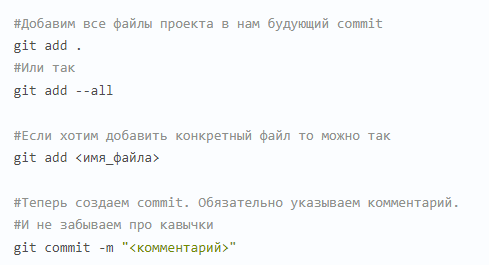

# Основные команды в GIT
* **Команда git init**

Позволяет указать папку, в которой git начнёт отслеживать изменения (в папке создаётся скрытая папка .git

* **Команда git status**

Показывает текущее состояние гита, есть ли изменения, которые нужно закоммитить (сохранить):
[git status](https://www.atlassian.com/ru/git/tutorials/inspecting-a-repository#:~:text=%D0%9A%D0%BE%D0%BC%D0%B0%D0%BD%D0%B4%D0%B0%20git%20status%20%D0%BE%D1%82%D0%BE%D0%B1%D1%80%D0%B0%D0%B6%D0%B0%D0%B5%D1%82%20%D1%81%D0%BE%D1%81%D1%82%D0%BE%D1%8F%D0%BD%D0%B8%D0%B5,%D1%8D%D1%82%D0%BE%D0%B3%D0%BE%20%D0%B8%D1%81%D0%BF%D0%BE%D0%BB%D1%8C%D0%B7%D1%83%D0%B5%D1%82%D1%81%D1%8F%20%D0%BA%D0%BE%D0%BC%D0%B0%D0%BD%D0%B4%D0%B0%20git%20log%20.)

* **Команда git add**

Добавляет содержимое рабочего каталога в индекс (staging area) для последующего коммита. Эта команда делается после добавления файлов в папку.

* **Команда git commit**

Позволяет зафиксировать или сохранить изменения.

* **Команда git log**

Позволяет просмотреть журнал изменений.

* **Команда git checkout**

Делает переключение между версиями.

*Для работы нужно указать не только интересующий вас коммит, но и вернуться в ту ветку, где работаем, при помощи команды git checkout master.*

* **Команда git diff**

Показывает разницу между текущим файлом и сохранённым.

* **Команда git branch**

Действия с ветками:

* **Команда git clone**

* **Команда git pull**

* **Команда git push**

**_Как сделать pull request_**

