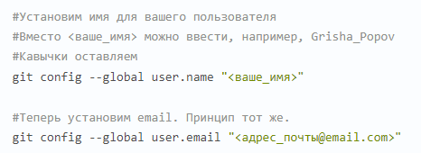
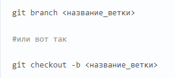

# **Git** - *программа для контроля версий.*
## Установка и настройка.
 Прежде чем использовать Git, вы должны установить его на своём компьютере. Вы можете установить Git из собранного пакета или другого установщика, либо скачать исходный код и скомпилировать его самостоятельно.

Вы установили себе Git и можете им пользоваться. Давайте теперь его настроим, чтобы когда вы создавали commit, указывался автор, кто его создал.

Открываем терминал (Linux и MacOS) или консоль (Windows) и вводим следующие команды.

## Начало работы.
Для создания первого репозитория указываем в консоли путь к папке, которую нужно сохранить. Затем вводим команду - __git init__. Теперь Git отслеживает изменения файлов вашего проекта. Но, так как вы только создали репозиторий в нем нет вашего кода. Для этого необходимо создать commit.

## Ветвление. 
__Ветка__ - это набор commit, которые идут друг за другом. У ветки есть название, основную ветку чаще всего называют master.

Ветвление - это возможность для реализации нового функционала или исправление багов нашего проекта.То есть, с отдельной веткой вы делаете что угодно, а затем сливаете эти изменения в основную ветку master.

Для добавления ветки вводим следующее.

Переключаться между ветками можно такой командой: __git chechout название ветки__.

После того, как вы завершили работу над своей задачей, ветку можно слить в master . Для этого нужно переключиться в ветку master и выполнить следующую команду: __git merge название ветки__.

## Работа с удаленными репозиториями.

**GitHub** — это сервис компании Microsoft, который позволяет интегрироваться с
программой Git и настроить удалённую работу с вашим репозиторием.

Вводим в терминале команду **git clone <url адрес репозитория>** - Git скопирует репозиторий, находящийся на сервисе GitHub, в наш локальный
репозиторий.

Чтобы работать локально в скачанном репозитории не забываем менять папку для git.(cd <название репозитория>).

Перед тем как отправить локальный репозиторий регистрируемся и создаем репозиторий.
GitHub предлагает советы. Он подсказывает, что можно сделать, чтобы начать работать с этим
репозиторием. У нас есть два варианта. GitHub говорит, что на самом деле вариантов три.
1. Можно создать новый репозиторий через терминал и начать с этим работать.
2. Уже существующий репозиторий привязать к удалённому репозиторию.
3. Импортировать код из другого репозитория.
У нас уже есть репозиторий, который работает локально. И сейчас мы хотим эту информацию
отправить на GitHub, чтобы она появилась в интернете. Для этого здесь есть подсказки.
Нам надо ввести git remote add origin и строчку, указанную на слайде. После этого указываем,
что основная ветка — main, и отправляем изменения в репозиторий.

**git pull** - команда, которая позволяет синхронизировать версию на пк с удаленным репозиторием(она не только подгрузит все изменения, но и
попытается смержить наши ветки).
**pull request** — это запрос на вливание в какой-то репозиторий.

На GitHub принято, чтобы у каждого проекта был файл **read me**, то есть файл с описанием того, что происходит внутри проекта. Когда мы хотим внести или предложить изменения в чей-то проект, это всегда делается в отдельной
ветке!

Для участия в чужом проекте мы сначала должны сделать копию этого репозитория. Для этого используется кнопка **Fork**.

## Основные команды.
* **git --version** - *проверка версии;*
* **git init** - *запуск;*
* **git status** - *информация о папке;*
* **git commit -m**"комментарий" - *замечание;*
* **git add** название_файла - *сохранение файла;*
* **git add .** - *сохранение всей папки;*
* **git log** - *журнал изменений от текущего;*
* **git log all** - *журнал изменений полностью;*
* **git checkout** название_сохранения - *вызов версии;*
* **git checkout master** - *актуальное состояние;*
* **git diff** - *разница с последним сохранением.*
* **git branch** название ветки - *добавление ветки.*
* **git merge название ветки** - *слияние ветки.*