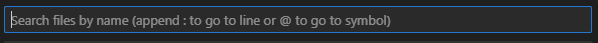
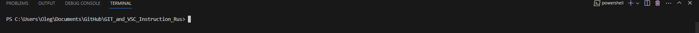

# Установка и настройка GIT при помощи Visual Studio Code
 

## Скачиваем и устанавливаем GIT и Visual Studio Code

* скачиваем GIT по ссылкам ниже для своей операционной системы и устанавливаем.

    * [Windows](https://git-scm.com/download/win)
    * [Linux](https://git-scm.com/download/linux)
    * [Mac OS](https://git-scm.com/download/mac)

* Рекомендуем ознакомиться с инструкцией по установке и настройки GIT по ссылке ниже.

    * [FAQ GIT](https://git-scm.com/book/ru/v2/)

* скачиваем Visual Studio Code по ссылкам ниже для своей операционной системы и устанавливаем.

    * [Windows, Linux or Mac](https://code.visualstudio.com/docs/supporting/faq)

* Рекомендуем ознакомится с инструкцией по установке и настройки Visual Studio Code по ссылке ниже.

    * [FAQ Visual Studio Code](https://code.visualstudio.com/docs/supporting/faq)

* После установки вышеперечисленного запускаем Visual Studio Code и немного настроим его.

    * Нажимаем последовательно кнопки на клавиатуре CTRL+P и вызовем командную строку для поиска и ввода параметров. Ниже скрин как выглядит командная строка параметров.

     

    * Вводим `>` для поиска параметров и через пробел дописываем `Auto Save` и кликаем по надписи. Этим самым мы включим авто-сохранение.
    * Если Вы хотите изменить язык интерфейса то вводим `>` для поиска параметров и через пробел дописываем `Configure Display Language` и кликаем по нему. После выбираем нужный язык. (Языковые файлы не предустановлены, поэтому придётся подождать, пока он их скачает)

    * Со всеми остальными параметрами можно ознакомится тут [FAQ Visual Studio Code](https://code.visualstudio.com/docs/supporting/faq)

## Познакомимся с основными (базовыми) командами GIT и настроим их

<u>**0 . Для начала запустим терминал (CTRL+`) в Visual Studio Code**</u>

 

<u>**1 . Как задать имя пользователя и адрес электронной почты**</u>

Имя пользователя нужно, чтобы привязывать коммиты к вашему имени. Это не то же самое, что имя пользователя учётной записи GitHub, с помощью которого выполняется вход в профиль на GitHub. Задать или изменить имя пользователя можно с помощью команды git config. Новое имя будет автоматически отображаться в последующих коммитах, отправленных на GitHub через командную строку. Если хотите скрыть своё реальное имя, можно использовать в качестве имени пользователя Git произвольный набор символов.

  `git config --global user.name "Ваше Имя"`

Кроме того, командой git config можно изменять адрес электронной почты, привязанный к вашим коммитам Git. Новый адрес электронной почты будет автоматически отображаться во всех дальнейших коммитах, поданных на GitHub через командную строку.

  `git config --global user.email "Ваш Email"`

<u>**2 . Кэширование учётных данных**</u>

Кэшировать учётные данные можно с помощью параметра config с флагом --global. Так вы избавитесь от необходимости вручную вводить имя пользователя и пароль при создании нового коммита.

  `git config --global credential.helper cache`

<u>**3 . Инициализация репозитория**</u>

Создать пустой репозиторий Git или вновь инициализировать существующий можно параметром init. При инициализации он создаст скрытую папку. В ней содержатся все объекты и ссылки, которые Git использует и создаёт в истории работы над проектом.

  `git init`

<u>**4 . Добавление отдельных файлов или всех файлов в область подготовленных файлов**</u>

Добавить отдельный файл в область подготовленных файлов можно параметром add с указанием имени файла. Для бвстроты поиска используйте `TAB`

  `git add имя файла`

Кроме того, можно добавить все файлы и папки в эту область.

  `git add .`

<u>**5 . Проверка статуса репозитория**</u>

Просмотреть статус нужного репозитория можно по ключевому слову status: его действие распространяется на подготовленные, неподготовленные и не отслеживаемые файлы.

  `git status`

<u>**6 . Внесение изменений однострочным сообщением или через редактор**</u>

При создании коммита в репозитории можно добавить однострочное сообщение с помощью параметра commit с флагом -m. Само сообщение вводится непосредственно после флага, в кавычках.

  `git commit -m "Ваше сообщение"`

Также можно открыть текстовый редактор в терминале для написания полного сообщения коммита. Оно может состоять из нескольких строк текста, в котором подробно характеризуются изменения, внесённые в репозиторий.

  `git commit`

<u>**7 . Просмотр истории коммитов с изменениями**</u>

Просматривать изменения, внесённые в репозиторий, можно с помощью параметра log. Он отображает список последних коммитов в порядке выполнения. Кроме того, добавив флаг -p, вы можете подробно изучить изменения, внесённые в каждый файл.

  `git log -p`

<u>**8 . Просмотр заданного коммита**</u>

Просмотреть полный список изменений, внесённых конкретным коммитом, можно с помощью параметра show, указав идентификатор или хеш коммита  (для примера 1af17e73721dbe0c40011b82ed4bb1a7dbe3ce29). Значение хеша уникально для каждого коммита, созданного в вашем репозитории.

  `git show 1af17e73721dbe0c40011b82ed4bb1a7dbe3ce29`

Также можно использовать сокращённый хеш.

  `git show 1af17e`

<u>**9 . Просмотр изменений до коммита**</u>

Можно просматривать список изменений, внесённых в репозиторий, используя параметр diff. По умолчанию отображаются только изменения, не подготовленные для фиксации.

  `git diff`

Для просмотра подготовленных изменений необходимо добавить флаг --staged.

  `git diff --staged`

Также можно указать имя файла как параметр и просмотреть изменения, внесённые только в этот файл.

  `git diff имя файла`

<u>**10 . Удаление отслеживаемых файлов из текущего рабочего дерева**</u>

Удалять файлы из текущего рабочего дерева можно с помощью параметра rm. При этом файлы удаляются и из индекса.

  `git rm имя папки/имя файла`

Можно также использовать маски файлов (например *.html) для удаления всех файлов, соответствующих критерию. Критерии можно создавать разные используя `*` как неизвестное

  `git rm имя папки/*.html`

<u>**11 . Переименование файлов**</u>

Переименовать файл или папку можно параметром mv. Для него указывается источник source и назначение destination. Источник — реально существующий файл или папка, а назначение — существующая папка.

  `git mv dir1/имя файла dir2`

При выполнении команды файл или папка, указанные как источник, будут перемещены в папку назначения. Индекс будет обновлён соответственно, но изменения нужно записать.

<u>**12 . Отмена подготовленных и неподготовленных изменений**</u>

Восстановить файлы рабочего дерева, не подготовленные к коммиту, можно параметром checkout. Для проведения операции требуется указать путь к файлу. Если путь не указан, параметр git checkout изменит указатель HEAD, чтобы задать указанную ветку как текущую.

  `git checkout имя файла`

Восстановить подготовленный файл рабочего дерева можно параметром reset. Потребуется указать путь к файлу, чтобы убрать его из области подготовленных файлов. При этом не будет производиться откат никаких изменений или модификаций — однако файл перейдёт в категорию не подготовленных к коммиту.

  `git reset HEAD имя файла`

Если нужно выполнить это действие для всех подготовленных файлов, путь к ним указывать не надо.

  `git reset HEAD`

<u>**13 . Изменение последнего коммита**</u>

Внести изменения в последний коммит можно параметром commit с флагом --amend. Например, вы записали изменения, внесённые в ряд файлов, и поняли, что допустили ошибку в сообщении коммита. В этом случае можете воспользоваться указанной командой, чтобы отредактировать сообщение предыдущего коммита, не изменяя его снимок.

  `git commit --amend -m "Обновлённое сообщение для предыдущего коммита"`

Также можно вносить изменения в файлы, отправленные ранее. Например, вы изменили несколько файлов в ряде папок и хотите их записать как единый снимок, но забыли добавить в коммит одну из папок. Чтобы исправить такую ошибку, достаточно подготовить для фиксации остальные файлы и папки и создать коммит с флагами --amend и --no-edit.

  `git add dir1`

  `git commit`

Здесь вы забыли добавить dir2 в коммит, вы можете выполнить
следующую команду, чтобы изменить другие файлы и папки.

  `git add dir2`

  `git commit --amend --no-edit`

Флаг --no-edit позволит внести в коммит поправку без изменения сообщения коммита. В этом случае итоговый коммит заменит неполный, а выглядеть это будет так, как будто мы отправили изменения ко всем файлам в нужных папках как единый снимок.

    Внимание! Не изменяйте публичные коммиты.

    С помощью amend прекрасно исправляются локальные коммиты, а исправления можно передать в общий репозиторий. Однако изменять коммиты, уже доступные другим пользователям, не следует. Помните, что изменённые коммиты являются совершенно новыми, а предыдущий коммит уже не будет доступен в текущей ветке. Последствия будут такими же, как при отмене изменений публичного снимка.

<u>**14 . Откат последнего коммита**</u>

Откатить последний коммит можно с помощью параметра revert. Создастся новый коммит, содержащий обратные преобразования относительно предыдущего, и добавится к истории текущей ветки.

  `git revert HEAD`

▍ Разница между revert и reset

Команда git revert отменяет изменения, записанные только одним коммитом. Она не откатывает проект к более раннему состоянию, удаляя все последующие коммиты, как это делает команда git reset.

У команды revert есть два крупных преимущества по сравнению с reset. Во-первых, она не меняет историю проекта и производит операцию, безопасную для коммитов. Во-вторых, её объектом выступает конкретный коммит, созданный в любой момент истории, а git reset всегда берёт за точку отсчёта текущий коммит. К примеру, если нужно отменить старый коммит с помощью git reset, придётся удалить все коммиты, поданные после целевого, а затем выполнить их повторно. Следовательно, команда git revert — гораздо более удобный и безопасный способ отмены изменений.

<u>**15 . Откат заданного коммита**</u>

Откатить проект до заданного коммита можно с помощью параметра revert и идентификатора коммита (к примеру 1af17e). Создастся новый коммит — копия коммита с предоставленным идентификатором — и добавится к истории текущей ветки.

  `git revert 1af17e`

<u>**16 . Создание новой ветки и переход в неё**</u>

Создать новую ветку можно с помощью параметра branch, указав имя ветки.

  `git branch имя ветки`

Но Git не переключится на неё автоматически. Для автоматического перехода нужно добавить флаг -b и параметр checkout.

  `git checkout -b nимя ветки`

<u>**17 . Просмотр списка веток**</u>

Можно просматривать полный список веток, используя параметр branch. Команда отобразит все ветки, отметит текущую звёздочкой (*) и выделит её цветом.

  `git branch`

Также можно вывести список удалённых веток с помощью флага -a.

  `git branch -a`

<u>**18 . Удаление ветки**</u>

Удалить ветку можно параметром branch с добавлением флага -d и указанием имени ветки. Если вы завершили работу над веткой и объединили её с основной, можно её удалить без потери истории. Однако, если выполнить команду удаления до слияния — в результате появится сообщение об ошибке. Этот защитный механизм предотвращает потерю доступа к файлам.

  `git branch -d имя ветки`

Для принудительного удаления ветки используется флаг -D с заглавной буквой. В этом случае ветка будет удалена независимо от текущего статуса, без предупреждений.

  `git branch -D имя ветки`

Вышеуказанные команды удаляют только локальную копию ветки. В удалённом репозитории она может сохраниться. Если хотите стереть удалённую ветку, выполните следующую команду:

  `git push origin --delete имя ветки`

<u>**19 . Слияние двух веток**</u>

Объединить две ветки можно параметром merge с указанием имени ветки. Команда объединит указанную ветку с основной.

  `git merge имя ветки`

Если надо выполнить коммит слияния, выполните команду git merge с флагом --no-ff.

  `git merge --no-ff имя ветки`

Указанная команда объединит заданную ветку с основной и произведёт коммит слияния. Это необходимо для фиксации всех слияний в вашем репозитории.

<u>**20 . Отображение журнала фиксации в виде графика для текущей или всех веток**</u>

Просмотреть историю коммитов в виде графика для текущей ветки можно с помощью параметра log и флагов --graph --oneline --decorate. Опция --graph выведет график в формате ASCII, отражающий структуру ветвления истории коммитов. В связке с флагами --oneline и --decorate, этот флаг упрощает понимание того, к какой ветке относится каждый коммит.

  `git log --graph --oneline --decorate`

Для просмотра истории коммитов по всем веткам используется флаг --all.

  `git log --all --graph --oneline --decorate`

<u>**21 . Прекращение слияния при конфликте**</u>

Прервать слияние в случае конфликта можно параметром merge с флагом --abort. Он позволяет остановить процесс слияния и вернуть состояние, с которого этот процесс был начат.

  `git merge --abort`

Также при конфликте слияния можно использовать параметр reset, чтобы восстановить конфликтующие файлы до стабильного состояния.

  `git reset`

<u>**22 . Добавление удалённого репозитория**</u>

Добавить удалённый репозиторий можно параметром remote add, указав shortname и url требуемого репозитория.

  `git remote add awesomeapp https://github.com/someurl..`

<u>**23 . Просмотр удалённых URL-адресов**</u>

Просматривать удалённые URL-адреса можно параметром remote с флагом -v. Этот параметр отображает удалённые подключения к другим репозиториям.

  `git remote -v`

Такая команда открывает доступ к интерфейсу управления удалёнными записями, которые хранятся в файле .git/config репозитория.

<u>**24 . Получение дополнительных сведений об удалённом репозитории**</u>

Получить подробные сведения об удалённом репозитории можно с помощью параметра remote show с указанием имени репозитория — например, origin.

  `git remote show origin`

Эта команда отображает список веток, связанных с удалённым репозиторием, а также рабочих станций, подключённых для получения и отправки файлов.

<u>**25 . Отправка изменений в удалённый репозиторий**</u>

Отправлять изменения в удалённый репозиторий можно параметром push с указанием имени репозитория и ветки.

  `git push origin main`

Эта команда передаёт локальные изменения в центральный репозиторий, где с ними могут ознакомиться другие участники проекта.

<u>**26 . Получение изменений из удалённого репозитория**</u>

Для загрузки изменений из удалённого репозитория используется параметр pull. Он скачивает копию текущей ветки с указанного удалённого репозитория и объединяет её с локальной копией.

  `git pull`

Также можно просмотреть подробные сведения о загруженных файлах с помощью флага --verbose.

  `git pull --verbose`

<u>**27 . Слияние удалённого репозитория с локальным**</u>

Слияние удалённого репозитория с локальным выполняется параметром merge с указанием имени удалённого репозитория.

  `git merge origin`

<u>**28. Отправка новой ветки в удалённый репозиторий**</u>

Передать новую ветку в удалённый репозиторий можно параметром push с флагом -u, указав имя репозитория и имя ветки.

  `git push -u origin имя ветки`

<u>**29 . Удаление удалённой ветки**</u>

Чтобы избавиться от удалённой ветки, используйте параметр push с флагом --delete, указав имя удалённого репозитория и имя ветки.

  `git push --delete origin ветки`

<u>**30 . Использование перебазирования**</u>

Для доступа к этой функции используйте параметр rebase с указанием имени ветки. Перебазирование — это процесс объединения или перемещения последовательности коммитов на новый родительский снимок.

  `git rebase ветки`

Эта команда изменит основу ветки с одного коммита на другой, как если бы вы начали ветку с другого коммита. В Git это достигается за счёт создания новых коммитов и применения их к указанному базовому коммиту. Необходимо понимать, что, хотя ветка и выглядит такой же, она состоит из совершенно новых коммитов.

### При ошибке команды в git он будет вам подсказывать возможные команды

### **Дополнительный список команд вы найдете тут** [FAQ GIT](https://git-scm.com/book/ru/v2/)

 