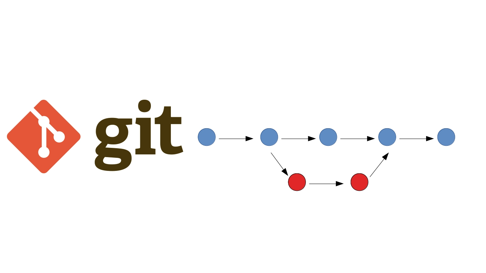

# Инструкция для работы с Git и удаленными репозиториями

## Что такое Git?

**Git** - это одна из реализаций распределенных систем контроля версий, имеющая как локальные, так и удаленные репозитории. Является самой популярной реализацией систем контроля версий в мире.

## Подготовка репозитория

Для создания репозитория необходимо выполнить команду **git init** в папке с репозиторием и у Вас создастся репозиторий (появится скрытая папка *.git*).

## Определение состояния

**`Git status`** показывает информацию о текущем состоянии репозитория: актуальна ли информация на нём, нет ли чего-то нового, что поменялось, и так далее.

## Фиксация изменений

Команда **`git add .`** или **`git add --all`** добавляет все файлы проекта в наш будущий commit. 

Если хотим добавить конкретный файл то можно так: **`git add <имя_файла>`**.

## Cоздание коммита

Создаем commit с помощью команды **`git commit -m "Add some code"`**.
Флажок *-m* задаст *commit message* - комментарий разработчика. Он необходим для описания закоммиченных изменений. Максимально ясно, просто и содержательно нужно обозначить написанное, желательно использовать английский язык.

## Cостояние проекта

Команда **`git status`** выводит информацию обо всех изменениях,
внесенных в дерево директорий проекта по сравнению с последним коммитом рабочей
ветки; отдельно выводятся внесенные в индекс и неиндексированные
файлы. Также **`git status`** указывает файлы с неразрешенными конфликтами слияния и
файлы, игнорируемые git.

## Просмотр внесенных изменений

Для просмотра все выполненных фиксаций можно воспользоваться историей коммитов. Она содержит сведения о каждом проведенном коммите проекта. Запросить ее можно при помощи команды **`git log`**. 
В ней содержится вся информация о каждом отдельном коммите, с указанием его хэша, автора, списка изменений и даты, когда они были сделаны.

## Просмотр недобавленных изменений

Команда **`git diff`** показывает изменения в файлах, которые еще не были добавлены в индекс коммита. Сравнение происходит с последним коммитом.

## Создание веток

Для начала работы с новой веткой нужно выполнить два действия:
1. Создать ветку с помощью команды **`git branch <имя ветки>**`;
2. Переключиться на свежесозданную ветку с помощью команды **`git checkout <имя ветки>`**.

## Переключение между ветками, извлечение файлов

Команда **`git checkout`** позволяет переключаться между коммитами. Для этого указывается **`git checkout <первые 4 символа хеша коммита>`**.  Эту информацию можно получить с помощью команды  **`git log`**.

Так же команда **`git checkout`** позволяет переключаться между ветками. Для этого указывается **`git checkout <название ветки>`**.

> Для переключения в ветку master нужно выполнить команду **`git checkout master`**.

## Слияние в Git

Чтобы выполнить мердж (от англ. *merge* – слияние), в Git предусмотрена команда **`git merge`**. Сливает изменения с переданной ветки в текущую.

Команда **`git merge`** принимает два указателя на коммиты (обычно последние в ветке) и находит общий для них родительский коммит. Затем Git создает коммит слияния, в котором объединяются изменения из обеих последовательностей, выбранных к слиянию.

## Разрешение конфликтов слияния

При попытке объединить ветки, в которых изменена одна и та же часть того же файла, Git не сможет сделать выбор между версиями. В таком случае операция останавливается прямо перед созданием коммита слияния, чтобы пользователь вручную разрешил конфликты.

Когда Git обнаруживает конфликт в ходе слияния, к затронутым файлам добавляются визуальные индикаторы по обе стороны проблемного содержимого: *`<<<<<<<`, `=======` и `>>>>>>>`*.

После обнаружения конфликтующих участков кода вы можете исправить их по своему усмотрению. Когда вы будете готовы завершить слияние, выполните команду **`git add`** для конфликтующего файла или файлов — так вы сообщите Git, что конфликт разрешен. Затем выполните обычную команду **`git commit`**.

## Работа с удаленным репозиторием

Команда **`git clone`** — создание копии (удаленного) репозитория.

##  Изменения в удаленном репозитории
После проведения работы в экспериментальной ветке, слияния с основной, необходимо обновить удаленный репозиторий (удаленную ветку). Для этого используется команда **`git push`**.

### Зачем пушить на сервер
* для работы в команде, чтобы делиться своим кодом с коллегами;
* чтобы иметь резервную копию на случай потери данных на своей машине.

##  Cкачивание данных с сервера
Похоже на клонирование репозитория, но с той разницей, что скачиваются не все коммиты, а только новые.
Команда **`git pull`**.
