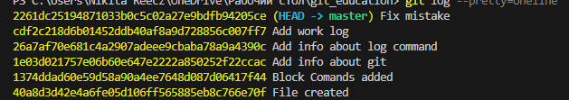

# Инструкция по GIT

## Что такое Git

**Git** — это система контроля версий. Или другими словами — хранилище, база данных истории разработки проекта. С помощью Git можно отслеживать историю разработки файлов проекта и, при необходимости, легко перемещаться между различными версиями. 

Git помогает группе разработчиков параллельно работать с файлами: каждый участник команды в любой момент может получить все уже созданные ранее версии файлов и при необходимости внести в них изменения. Git также незаменим при разработке, потому что в случае возникновения ошибки из-за новой версии файла можно легко откатиться на одну из прошлых его версий, восстановив работоспособность программы, и сделать это буквально с помощью пары команд. 

## Как работать с Git

Если пытаться максимально упрощённо описать алгоритм работы с Git, то получим следующую последовательность действий:

1. Указать Git'у в какой папке следует отслеживать изменения.
2. После совершения изменений в одном/нескольких файлах или создания новых, указать, что эти изменения следует сохранить. 
3. Зафиксировать совершенные изменения. 

### Основные команды при работе с Git

Список команд git, конечно, значительно шире, чем те, что будут описаны ниже. Но пока что будем говорить только о самых базовых командах. Знание этих команд уже позволить начать работу с git. 

* **git init**: инициализируем папку как git-папку
* **git status**: узнаём статус происходящего в папке — имеются ли какие-либо изменения в старых файлах, добавлены ли новые. Также эта команда сообщает в какой рабочей ветке мы находимся.
* **git add**: добавляем совершенные изменения в коммит. Можем выделять только те файлы, изменения в которых, мы хотим закоммитить. 
    - Файл, который необходимо добавить в коммит указывается после команды `git add`. Чтобы добавить в коммит все измененные файлы, достаточно написать команду `git add .`
* **git commit**: делаем коммит.
    - Можем добавить флаг `-m`, чтобы прикрепить к коммиту текстовое сообщение. Это упростит нам дальнейшую работу, так как будет легче понять, в каком коммите какие изменения были сделаны. Пример: `git commit -m "Add new function calc_profit"`
* **git log**: позволяет отслеживать историю ранее совершенных коммитов. 
    - Если использовать эту команду с флагом `pretty`, то формат вывода будет гораздо более юзер-френдли: `git log --pretty=oneline`
* **git branch**: отображается все ветки, в которых проходила работа.  
    - добавление флага `-D` помогает удалить ветку, например: `git branch -D new_function`

### Команды для работы с удалёнными репозиториями

* **git clone**: клонируем удалённый репозиторий себе локально, чтобы начать с ним работу. После `git clone` необходимо указать ссылку на репозиторий.
* **git pull**: забираем к себе актуальное на данный момент состояние репозитория. 
* **git push**: отправляем совершённые изменения в удалённый репозиторий. 

### P.S.

Как мы уже увидели на примерах выше, команды также можно усложнять и модифицировать путём добавления флагов, тем самым «общаясь» с git-ом на более продвинутом уровне, но об этом всём поговорим попозже.

Более подробный список команд можно найти по ссылке в статье [Шпаргалка по Git, в которой представлены основные команды](https://proglib.io/p/git-cheatsheet). 