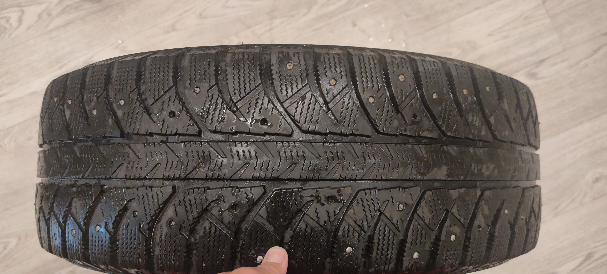

# Инструкция для работы с Маркдаун

## Выделение текста 

Что бы выделить текст курсивом необходимо обрамить его звездочками (*). Например *вот так* или _вот так_.

Что бы выделить текст полужирным необходимо обрамить его двойными звездочками (**).
Например **вот так** или __вот так__ двойным знаком нижнего подчеркивания.
 
 Альтернативные способы выделения текста жирным или курсивом нужны для того что бы мы могли совмещать оба этих способа. Например,
 _текст может быть выделен курсивом и при этом быть **жирным**_.
 

## Списки
Создаем списки
Нумерованные :
1. Элемент
2. Элемент
3. И т.д.

Не нумерованные:
* Элемент 1
* Элемент 2
* Элемент 3

## Работа с Изоброжениями
Чтобы вставиьт изображение в текст, достаточно написать следующе:

## Ссылки 

<code>https://vk.com/idmartynov_realty Ссылка на мой вк </code>
## Работа с Цитатами 
Достаточно добавить >  в начале строки

## Цитаты

>*Ну что поехали* 

## Заключение
*Прикольный синтаксис прост и легок!*

# Домашнее задание ко второму семениру 
## Задание:

* Сделать 4 ветки 
* создать конфиликт 
* решить конфликт

## Таблицы
Задаются при помощи | вертикальныз полос| и горизонтальных --, где вертекальные стенки столбца, горизонтальные разделение строк  

| Столбик 1 | Столбик 2 |
|-----|-----|
| Что то под столбиком 1 | Что то под столбиком 2 |

## Таблицы
Задаются при помощи | вертикальныз полос| и горизонтальных --, где вертекальные стенки столбца, горизонтальные разделение строк , :: Выравнивание

| Столбик 1 | Столбик 2 |
|:-----:|:-----:|
| Что то под столбиком 1 | Что то под столбиком 2 |

объединил  две ветки думал получится конфлик, не получилось, пау пау пауууууу(

# Пытаюсь создать конфликт
## Что бы потом его решить
 как я это буду делать ?
объединил  две ветки думал получится конфлик, не получилось, пау пау пауууууу(
    ЧТо то пишу что бы отлечить третью ветку
Комит, что принял оба изменения

# С 75 строки вношу дополнения для 3 урока

## Гиперссылки
Markdown поддерживает два стиля оформления ссылок:

Гиперссылка, с немедленным указанием адреса (внутритекстовая);
Гиперссылка, подобная сноске.
Подразумевается, что помимо URL-адреса существует еще текст ссылки. Он заключается в квадратные скобки. Для создания внутритекстовой гиперссылки необходимо использовать круглые скобки сразу после закрывающей квадратной. Внутри них необходимо поместить URL-адрес. В них же возможно расположить название, заключенное в кавычки, которое будет отображаться при наведении, но этот пункт не является обязательным.

  [пример](http://vk.ru/ "Необязательная подсказка")
В результате на экран выводится следующее: пример При ссылке на локальную директорию возможно использование относительного пути (от текущей страницы, сайта и т.п.)

# Git оснавные комманды 
- checkout
- git branch
- git status 
- git add 
- git merge
- git log 