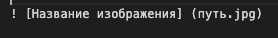

# Синтаксис языка Markdown #

Если необходимо ввести заголовок, то отмечаем  # в начале строки.

### Списки

Для разметки списков можно использовать `*` или нумерацию:

1. элемент 1
2. элемент 2
3. элемент 3

### Изображение

Чтобы добавить к тексту изображение, необходимо добавить  следующее:

### Курсив
Чтобы написать текст курсивом, нужно поставить * в начале текста и в конце - *текст*

### Цитаты
Цитаты оформляются как в емейлах, с помощью символа `>`:
>Per aspera ad astra

# Команды:
Для начала следует узнать версию программы, для этого вводим команду -  **git --version**, после - создаем ремозиторий.

### git init
Необходимо указать папку, в которой git начнёт отслеживать изменения.

### git status
Показывает текущее состояние гита, есть ли изменения, которые можно сохранить.

### git add
Добавляет содержимое рабочего каталога в индекс для последующего коммита. Эта команда дается после добавления файлов.

### git commit
Команда **git commit** берёт все данные, добавленные в индекс с помощью **git add**, и сохраняет их слепок во внутренней базе данных, а затем сдвигает указатель текущей ветки на этот слепок.

### git log
Журнал изменений.

### git checkout
Переключение между версиями. Вернуться в тот, где работаем, при помощи команды **git checkout master**.

### git diff
Показывает разницу между сохраненным файлом и текущим.

### git branch
Показывает список существующих веток. Этой же командой можно создать ветку, добавив название

**Git отслеживает файлы по имени! Если изменить имя файла, необходимо добавить файл с новым именем + git commit**. Это дает возможность сохранить версию и оставить комментарий.